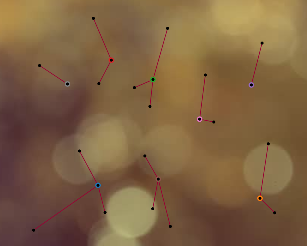
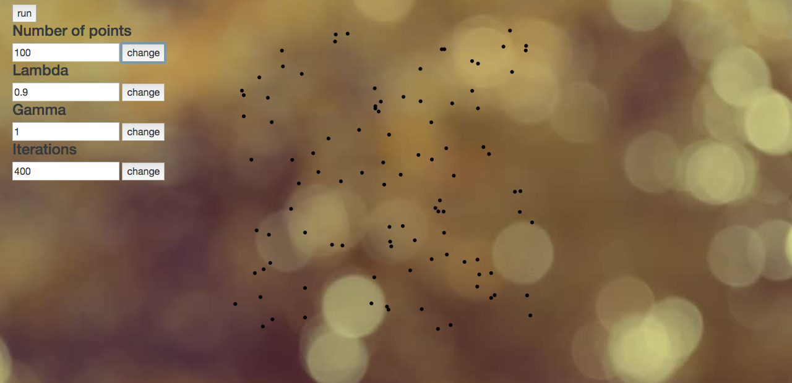
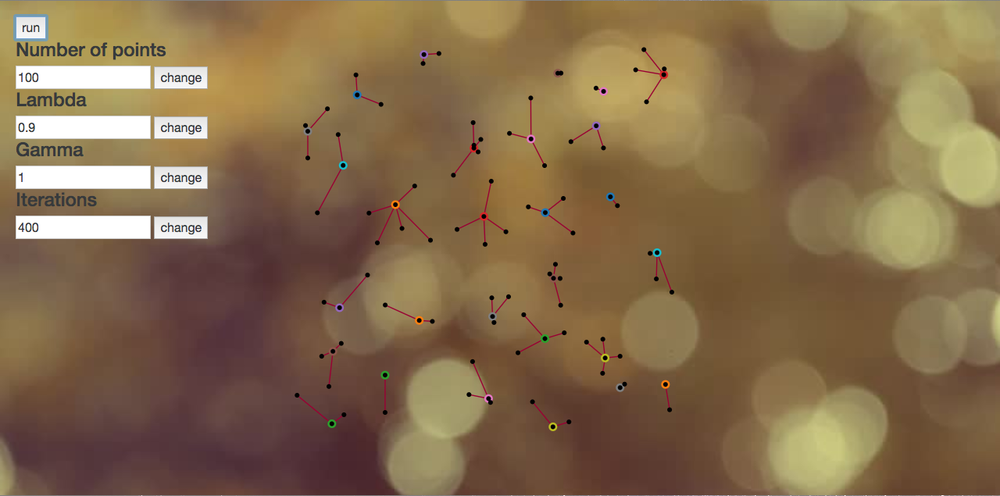

# Affinity Propagation

This repository contains the javascript version of the clustering algorithm [affinity propagation](https://en.wikipedia.org/wiki/Affinity_propagation).
The implementation take inspiration from the linked [C code](https://github.com/jincheng9/AffinityPropagation/blob/master/affinity_propagation.cpp).
The html code in contents gives a graphical representation of the clustering process.

Each cluster is identified by his Representant that is denoted through the colored circle All cluster members are joined together through a red stroke that connect them to the Rapresentant 
Is possible to manage all appearing paramenters in order to produce different kind of clustering. 

The **run** button will trigger the clustering process:

# How to use this js code

The code takes in **input** an array containing all points position in the required metric sistem and a distance function capable to compare them.In default usage it has been used the Euclidean Metric (which can be subtituted by another).

 Such function has to retrieve a number between 0 and 1(0 to express minimal distance if not the point itself and 1 for the maximal distance). 
 The **output** is saved after execution and consist of two arrays:
 - information about cluster belonging 
 - clusters representants.

 In this code have been used [jsonfie](https://www.npmjs.com/package/jsonfile) and [colors](https://www.npmjs.com/package/colors) packages.
 For the graphical representation it has been used the [d3](https://d3js.org/) js library